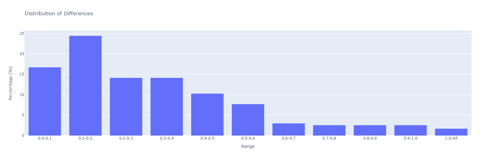
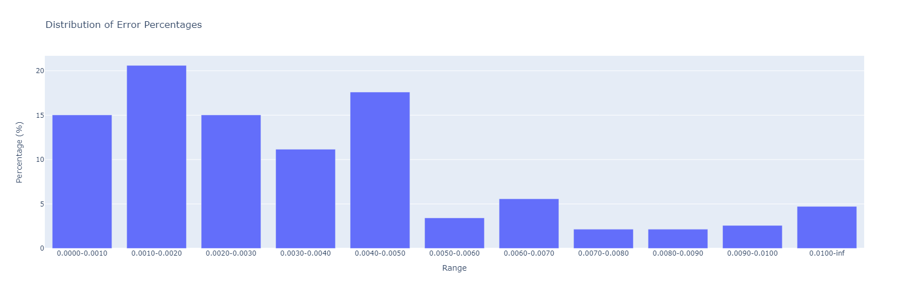

# Overview

The purpose of this project is to predict the target with input1 and input2.

In this directory, you can find:

- resouce csv files (input1, input2, target)
- the notebook showing the whole process (bleaching.ipynb)
- the best model (lstm.sav)
- the environment file (environment.yml)
- prediction file (prediction.py)

You can reproduce this environment via

`conda env create -f environment.yml`

then activate it by:

`conda activate <name_env>`

Note that there is no pytorch in this yaml file (because there is no pytorch on my new computer...).

If you have pytorch locally, very good! otherwise, you may also use google colab to avoid the environment problem
https://colab.research.google.com/drive/1wg5DZWu9e5ZUo9EgVo8X4bbcxxpp5oJv?usp=sharing

# Process
There are 2 principle steps in the preocess, which are feature selection and model selection.

## Feature selection
Two methods were utilised for feature selection, which are:

- fisher score + correlation
- enbedded method with random forest

It turns out that the second one performes better.

## Model selection

As for the model selection, Random Forest, Xgbost and lightlgb were tried, for each of them, a grid search was carried out in order to find the best parameters and a K-fold validation was realised on the best model, to reduce overfitting.

At last, we trained a neural network based on Long Short Term Memory (LSTM) and compared the performance with tree-based models.

# Results
the distribution of error

the distribution of error/groundtruth

